# 👋 Hey, I'm Valerie Jerono 

<div align="center">


[](https://www.linkedin.com/in/valerie-jerono)
[](mailto:kipropvalerie@gmail.com)
[]()


</div>

---

## 🌍 Kwa Ufupi (In Short)

<div align="center">

> *"I build AI systems that don't just predict outcomes—they explain why those outcomes occur."*


</div>

My roots are in **actuarial science**, where I mastered reasoning under uncertainty. Today, as a **Research Scholar at @iLabAfrica** and **Master's student at Strathmore University**, I work at the intersection of:

<table align="center">
<tr>
<td align="center" width="33%">

<br><b>Risk Analytics</b>
<br><sub>Insurance • Fraud Detection • Credit Scoring</sub>
</td>
<td align="center" width="33%">

<br><b>Behavioral Modeling</b>
<br><sub>Human Decisions • Incentives • Patterns</sub>
</td>
<td align="center" width="33%">

<br><b>Explainable AI</b>
<br><sub>Transparent Models • Stakeholder Trust</sub>
</td>
</tr>
</table>

If you're here expecting just another developer profile, grab some coffee ☕ and stay. I see data not as numbers in spreadsheets, but as **living maps of behaviors, risks, opportunities, and untold stories**.

---

## 🧠 How I Approach Data

<div align="center">

</div>

Data is **patterns, behaviors, risks, opportunities, and signals** waiting to be decoded. My approach blends **industry intuition** from insurance operations with **academic rigor** from my Master's research.

```mermaid
graph LR
    A[📊 Meet Variables] --> B[🔍 Follow Clues] 
    B --> C[🧹 Clean Evidence]
    C --> D[🔗 Connect Dots]
    D --> E[📈 Uncover Plot]
    E --> F[💡 Clear Recommendations]
    
    style A fill:#40E0D0,stroke:#333,stroke-width:2px,color:#000
    style B fill:#FF6B6B,stroke:#333,stroke-width:2px,color:#000
    style C fill:#4ECDC4,stroke:#333,stroke-width:2px,color:#000
    style D fill:#45B7D1,stroke:#333,stroke-width:2px,color:#000
    style E fill:#96CEB4,stroke:#333,stroke-width:2px,color:#000
    style F fill:#FECA57,stroke:#333,stroke-width:2px,color:#000
```


---

## 🛠️ Technical Arsenal

<div align="center">

### 🐍 Core Languages


### 🤖 ML & AI Stack


### 📊 Data Science


### 📈 Visualization & BI


### ⚙️ Tools & Platforms


</div>

---

## 💡 My Philosophy

<div align="center">


I don't believe in **"magic models"** 🪄—I believe in **purpose-driven pipelines** built on solid foundations.

</div>

<table>
<tr>
<td align="center" width="20%">

<br><b>Purpose First</b>
<br><sub>Know <i>why</i> before <i>how</i></sub>
</td>
<td align="center" width="20%">

<br><b>Story Over Stats</b>
<br><sub>Insights must be actionable</sub>
</td>
<td align="center" width="20%">

<br><b>Iterate Relentlessly</b>
<br><sub>Feedback drives excellence</sub>
</td>
<td align="center" width="20%">

<br><b>Ethical AI</b>
<br><sub>Responsibility = Accuracy</sub>
</td>
<td align="center" width="20%">

<br><b>Collaboration Wins</b>
<br><sub>Together we achieve more</sub>
</td>
</tr>
</table>

---

## 🔄 My Problem-Solving Flow

<div align="center">
```
🎯 Understand → 🛠 Prepare → 🔍 Explore → 🤖 Model → ✅ Evaluate → 📢 Communicate → 🚀 Improve
```


</div>

<table>
<tr>
<td width="50%" valign="top">

**🎯 Start Right**
- Begin with the *right* question
- Define clear objectives
- Understand stakeholder needs

**🧹 Respect Reality**  
- Clean data thoroughly
- Handle missing values properly
- Validate data quality

</td>
<td width="50%" valign="top">

**💬 Translate Results**
- Make insights actionable
- Create compelling narratives
- Bridge technical and business

**🔄 Keep Evolving**
- Iterate based on feedback  
- Monitor model performance
- Adapt to changing requirements

</td>
</tr>
</table>

---

## 📊 GitHub Analytics

<div align="center">

### 💻 Coding Metrics


</div>

<div align="center">

<picture>
  <source media="(prefers-color-scheme: dark)" srcset="https://github-readme-stats.vercel.app/api?username=VAL-Jerono&show_icons=true&theme=radical&hide_border=true&bg_color=0d1117&title_color=58a6ff&icon_color=1f6feb&text_color=c9d1d9&border_radius=10&include_all_commits=true&count_private=true">
  
</picture>

<picture>
  <source media="(prefers-color-scheme: dark)" srcset="https://github-readme-streak-stats.herokuapp.com?user=VAL-Jerono&theme=radical&hide_border=true&background=0d1117&stroke=58a6ff&ring=1f6feb&fire=f85149&currStreakLabel=c9d1d9&sideLabels=58a6ff&currStreakNum=c9d1d9&dates=8b949e&border_radius=10">
  
</picture>

</div>

<div align="center">

<picture>
  <source media="(prefers-color-scheme: dark)" srcset="https://github-readme-stats.vercel.app/api/top-langs/?username=VAL-Jerono&theme=radical&hide_border=true&bg_color=0d1117&title_color=58a6ff&text_color=c9d1d9&layout=donut-vertical&border_radius=10&langs_count=8">
  
</picture>

<picture>
  <source media="(prefers-color-scheme: dark)" srcset="https://github-profile-summary-cards.vercel.app/api/cards/productive-time?username=VAL-Jerono&theme=radical&utcOffset=3">
  
</picture>

<picture>
  <source media="(prefers-color-scheme: dark)" srcset="https://github-profile-summary-cards.vercel.app/api/cards/most-commit-language?username=VAL-Jerono&theme=radical">
  
</picture>

</div>

<div align="center">

### 📈 Contribution Activity

<picture>
  <source media="(prefers-color-scheme: dark)" srcset="https://github-readme-activity-graph.vercel.app/graph?username=VAL-Jerono&theme=github-dark-dimmed&hide_border=true&bg_color=0d1117&color=58a6ff&line=1f6feb&point=f85149&area=true&radius=10&custom_title=Contribution%20Graph">
  
</picture>

</div>

<div align="center">

### 🏆 Achievements

<picture>
  <source media="(prefers-color-scheme: dark)" srcset="https://github-profile-trophy.vercel.app/?username=VAL-Jerono&theme=radical&no-frame=true&no-bg=true&column=7&margin-w=10&margin-h=10">
  
</picture>

</div>

---

## 🤝 Let's Connect

<div align="center">


**If you care about data that has a purpose, we're already speaking the same language.** 🗣️

<br>

💼 **[Connect on LinkedIn](https://www.linkedin.com/in/valerie-jerono)** | 📧 **[Email Me](mailto:kipropvalerie@gmail.com)** | 🌍 **Based in Nairobi, Kenya**

</div>

---

<div align="center">

### *"Numbers tell the truth. I make sure they tell it well."* ✨


**⭐ Star this profile if you found it interesting!**


</div>