```mermaid
graph LR
    A[📊 Meet Variables] --> B[🔍 Follow Clues] 
    B --> C[🧹 Clean Evidence]
    C --> D[🔗 Connect Dots]
    D --> E[📈 Uncover Plot]
    E --> F[💡 Clear Recommendations]
    
    style A fill:#40E0D0,stroke:#333,stroke-width:2px,color:#000
    style B fill:#FF6B6B,stroke:#333,stroke-width:2px,color:#000
    style C fill:#4ECDC4,stroke:#333,stroke-width:2px,color:#000
    style D fill:#45B7D1,stroke:#333,stroke-width:2px,color:#000
    style E fill:#96CEB4,stroke:#333,stroke-width:2px,color:#000
    style F fill:#FECA57,stroke:#333,stroke-width:2px,color:#000
```

# 🌟 Hey, I'm Valerie Jerono 

<div align="center">


[](https://www.linkedin.com/in/valerie-jerono)

[](mailto:kipropvalerie@gmail.com)

[]()


</div>

---

## 🌍 Kwa Ufupi

<div align="center">

> ### *"I help numbers make sense and stories make an impact."*


</div>

My roots are in **actuarial science** where I mastered the precision of numbers, yet curiosity soon drew me into the broader world of data science and analytics. Now I work at the intersection of:

<table align="center">
<tr>
<td align="center">

<br><b>Risk Analysis</b>
</td>
<td align="center">

<br><b>Behavior Analytics</b>
</td>
<td align="center">

<br><b>Intelligent Systems</b>
</td>
</tr>
</table>

If you arrived expecting just another developer profile, you may want to pour yourself a coffee ☕ and stay a little longer. 

I see data not simply as numbers in a spreadsheet, but as a **living map of behaviours, risks, opportunities, and stories** that have not yet been told.


---

## 🧠 How I Approach Data

<div align="center">

</div>

Data isn't just numbers. It's **patterns**, **behaviours**, **risks**, **opportunities** and **signals** waiting to be decoded.



My process blends **industry intuition** from hands-on work in insurance operations and customer analytics with **academic depth** from my current Master's studies, all supported by a commitment to practical innovation.

---

## 🛠 My Technical Toolkit

<div align="center">

### 🐍 Programming Languages


### 🤖 Machine Learning & AI


### 📊 Visualization & BI


### ⚙️ Data Engineering & Tools


</div>


---

## 🔄 My Problem-Solving Flow

<div align="center">

```
🎯 Understand → 🛠 Prepare → 🔍 Explore → 🤖 Model → ✅ Evaluate → 📢 Communicate → 🚀 Improve
```


</div>

I don't believe in **"magic models"** 🪄, I believe in **purpose-driven pipelines** that:

<table>
<tr>
<td width="50%" valign="top">

**🎯 Start Right**
- Begin with the *right* question
- Define clear objectives
- Understand stakeholder needs

**🧹 Respect Reality**  
- Clean data thoroughly
- Handle missing values properly
- Validate data quality

</td>
<td width="50%" valign="top">

**💬 Translate Results**
- Make insights actionable
- Create compelling narratives
- Bridge technical and business

**🔄 Keep Evolving**
- Iterate based on feedback  
- Monitor model performance
- Adapt to changing requirements

</td>
</tr>
</table>


---

## 💡 My Philosophy

<div align="center">


</div>

<table>
<tr>
<td align="center" width="20%">

<br><b>Purpose First</b>
<br><sub>Know <i>why</i> before <i>how</i></sub>
</td>
<td align="center" width="20%">

<br><b>Story Over Stats</b>
<br><sub>Insights must be actionable</sub>
</td>
<td align="center" width="20%">

<br><b>Iterate Relentlessly</b>
<br><sub>Feedback drives excellence</sub>
</td>
<td align="center" width="20%">

<br><b>Ethical AI</b>
<br><sub>Responsibility = Accuracy</sub>
</td>
<td align="center" width="20%">

<br><b>Collaboration Wins</b>
<br><sub>Together we achieve more</sub>
</td>
</tr>
</table>


---

## 🌟 GitHub Stats

<div align="center">


</div>


---

## 🤝 Let's Connect

<div align="center">


**If you care about data that has a purpose, we're already speaking the same language.** 🗣️

<br>

💼 **[Connect on LinkedIn](https://www.linkedin.com/in/valerie-jerono)** |

 📧 **[Email Me](mailto:kipropvalerie@gmail.com)** |
 
  🌍 **Based in Nairobi, Kenya and collaborating globally**

</div>


---

<div align="center">

### *"Numbers tell the truth. I make sure they tell it well."* ✨


**⭐ Don't forget to star this repository if you found it interesting!**

</div>